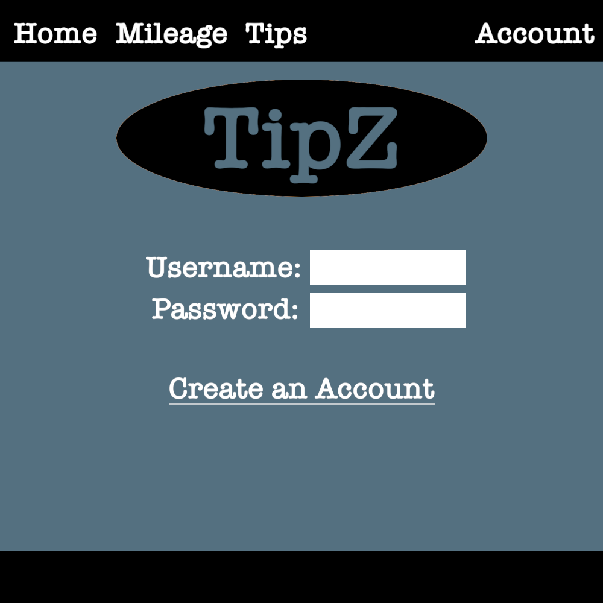
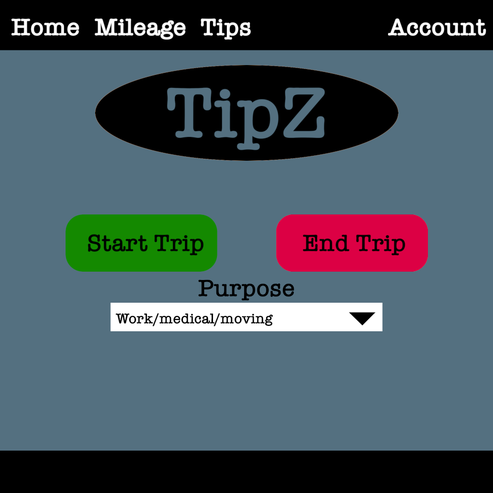
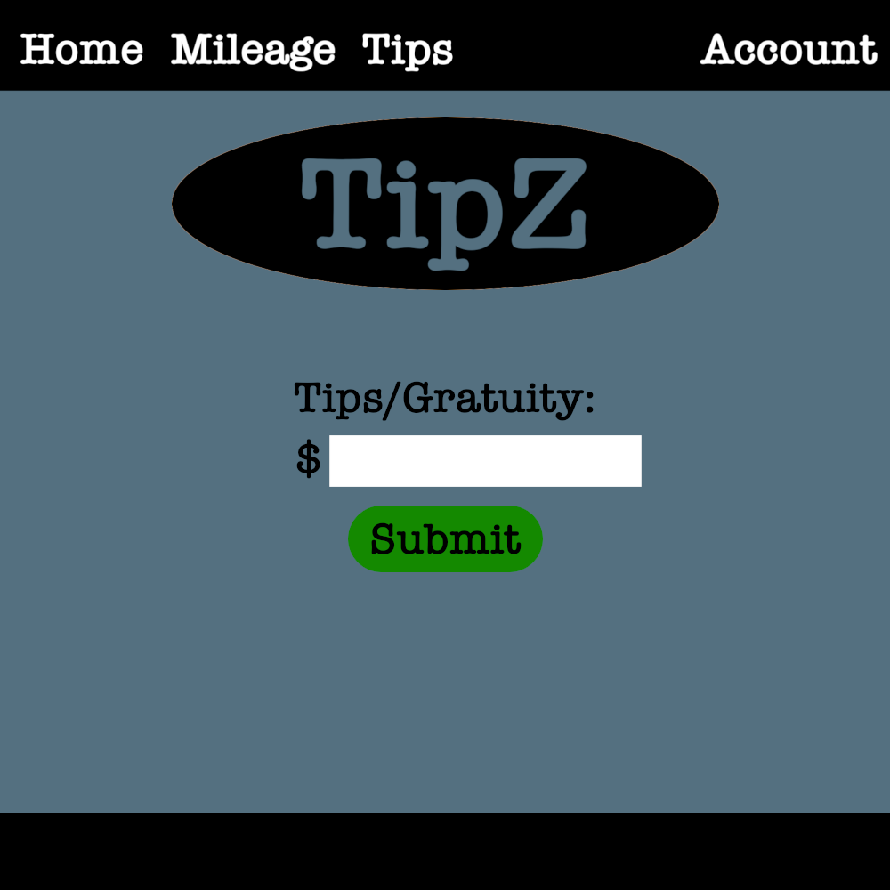
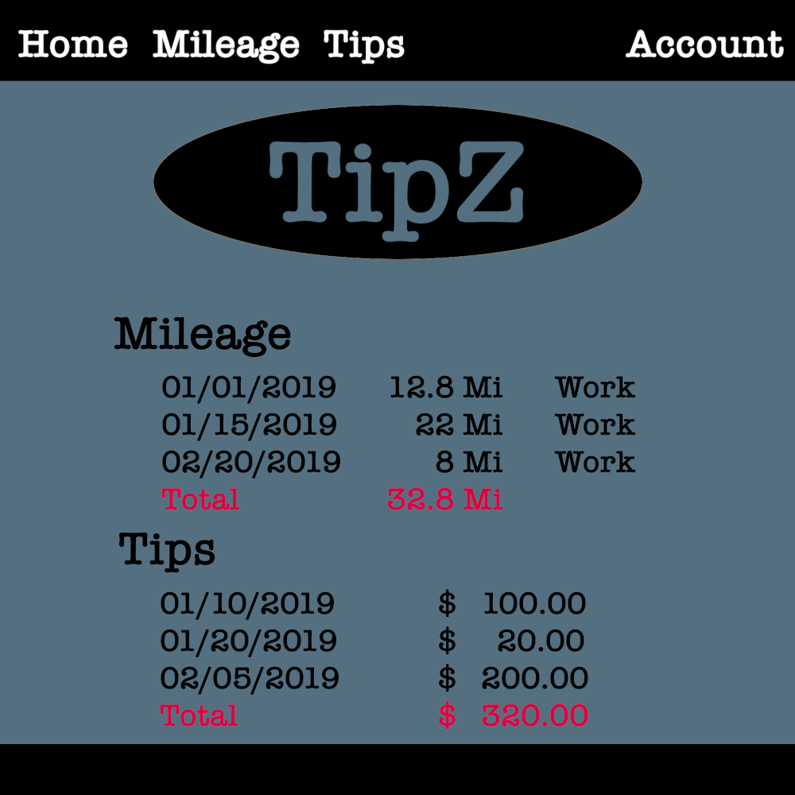
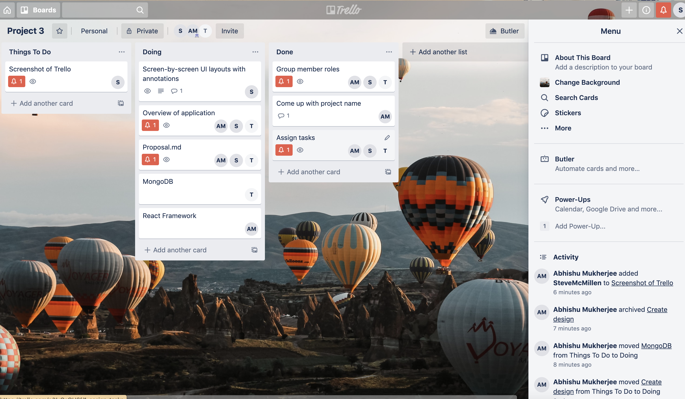

# TipZ

## Team Members: ##
- Tom Cox - Database / MongoDB
- Abhishu Mukherjee - Front-End / UI
- Steve McMillen - API / Back-End

## Description:  ##
TipZ is a web app that allows users to log and track tips and mileage more effectively. This website is aimed specifically at people who work in the service/catering industry who often miss out on tax deductions because of poorly tracked tips and/or mileage deductions. The website would also be a great tool for laborors/contractors who visit multiple job sites in  a fiscal year (Painters, Plumbers, Handymen, etc.). TipZ allows users to create a free account in order to track mileage and tips. These totals can then be pulled up and used on their tax returns to ensure users maximize deductions on their tax returns. There are a few mileage tracking applications and tip tracking applications, but our site incorporates both of them in one easy to use website.

## Layout / Pages ##
1. Home Page - Login/Sign Up
2. Mileage Tracker - "Start/End Trip" buttons
3. Tips & Gratuity page - Input screen for tips/gratuity
4. User Profile - Displays user info & mileage/tips totals

## HOME

## MILEAGE

## TIPS

## ACCOUNT/TOTALS

## Technologies to be used ##
- MapBox API / Open Cage API - Track distance traveled / Route distance
- D3.js - Data Visualization
- Marmoset Hexels - Styling & Animation

## Project Management Software: TRELLO

## Rough breakdown of the tasks ##
- Track user location while they travel for work.
- Log trip information (date, distance) in a database.
- Take user input to log gratuity/tips in a database.
- Display running totals for travel distance/tips for use in tax return preparation.
